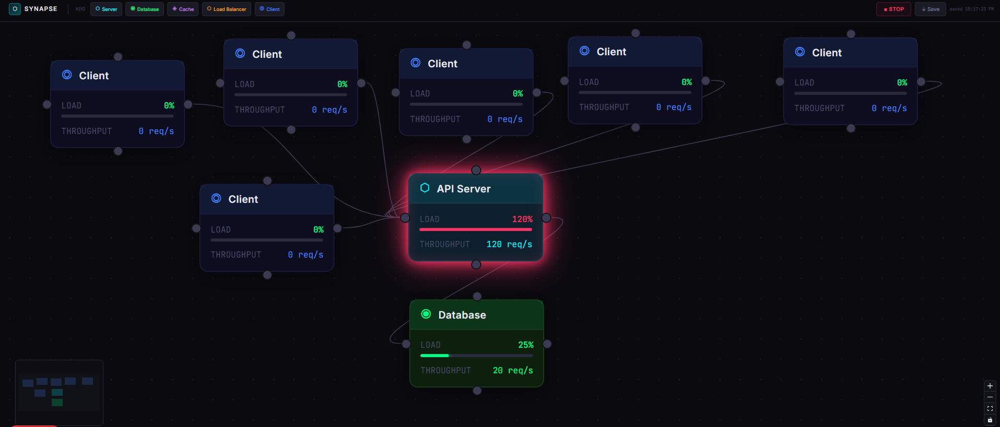

<div align="center">

# ⬡ SYNAPSE

### Real-Time Infrastructure Simulation Engine

*Design a system topology. Run the simulation. Watch your bottlenecks glow red.*

[](https://nodejs.org)
[](https://nextjs.org)
[](https://socket.io)
[](https://upstash.com)
[](https://mongodb.com)

</div>

---

## What is Synapse?

Synapse is an event-driven infrastructure simulation engine. Drag nodes onto a canvas — servers, databases, load balancers, caches, clients — connect them to model a real system architecture, then run a live simulation that calculates traffic throughput across the graph in real time.

Overloaded nodes pulse red. Warning nodes glow amber. Healthy nodes stay green. The bottleneck is always obvious.



---

## Architecture

```
Client (Next.js + React Flow)
        │
        │  WebSocket (Socket.IO)
        ▼
Express Server
  ├── Socket.IO handlers      → room management, simulation events
  ├── Simulation engine       → graph traversal, load calculation
  ├── REST API                → GET/POST/DELETE /api/canvas/:id
  └── Redis Pub/Sub adapter   → scales across multiple server instances
        │
        ├── Redis   → live canvas state + Pub/Sub broadcasting
        └── MongoDB → durable canvas storage (write-throttled, 5s flush)
```

### How the simulation works

Each node has a typed capacity (`server: 100 units`, `database: 80`, `loadbalancer: 200`). Each edge carries 20 units/tick. The engine sums all incoming load per node every second and calculates utilization:

- **< 75%** → healthy (green)
- **≥ 75%** → warning (amber glow)
- **≥ 100%** → overloaded (red neon pulse)

### The write-throttle pattern

Socket events fire up to 20× per second. Writing to MongoDB on every event would kill performance. Instead, all mutations hit Redis instantly, and a background timer flushes to MongoDB every 5 seconds — the same dual-write pattern used by production collaborative tools.

---

## Tech Stack

| Layer | Technology |
|---|---|
| Backend | Node.js + Express |
| Real-time | Socket.IO + `@socket.io/redis-adapter` |
| Caching & Pub/Sub | Redis (Upstash) |
| Database | MongoDB (Atlas) |
| Frontend | Next.js 16 + Tailwind CSS |
| Canvas | `@xyflow/react` (React Flow) |
| State management | Zustand |

---

## Getting Started

### Backend

```bash
cd synapse-backend
npm install
```

Create `.env`:

```env
PORT=4000
NODE_ENV=development
CLIENT_ORIGIN=http://localhost:3000
MONGO_URI=your_mongodb_uri
REDIS_URL=your_redis_url
SIMULATION_TICK_MS=1000
WRITE_FLUSH_INTERVAL_MS=5000
```

```bash
npm run dev
```

### Frontend

```bash
cd synapse-frontend
npm install
```

Create `.env.local`:

```env
NEXT_PUBLIC_BACKEND_URL=http://localhost:4000
```

```bash
npm run dev
```

Open `http://localhost:3000`.

---

## How to Use

1. Add nodes from the toolbar — Server, Database, Cache, Load Balancer, Client
2. Connect nodes by dragging from one node's handle to another
3. Press **RUN SIM** — the engine calculates load every second
4. Watch nodes change color as traffic accumulates
5. **Ctrl+S** to save your canvas
